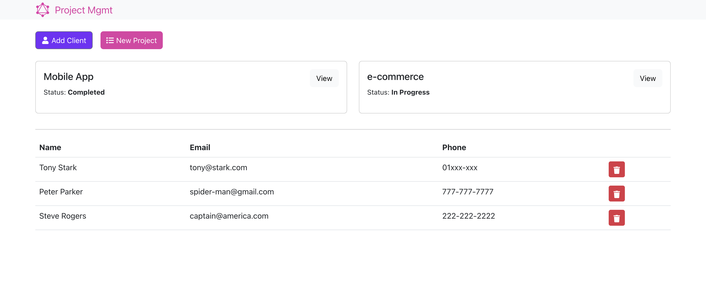
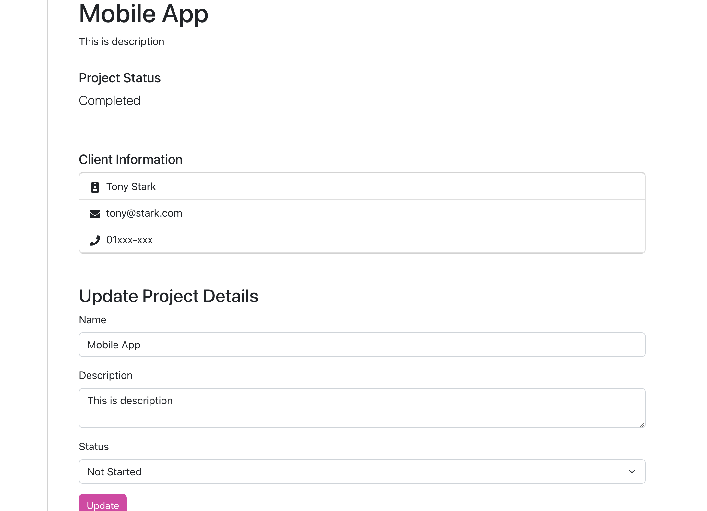
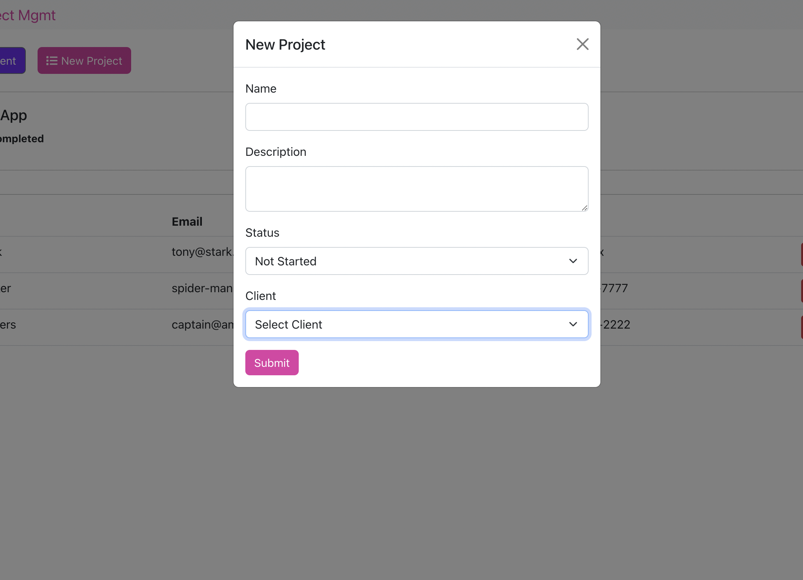

<div align="center">
  <h1>Project Management App (MERN)</h1>
  <p>An awesome GraphQL project!</p>

</div>

<br />

### Screenshots

<div align="center"> 
<sub>Dashboard</sub>
  
<sub>Project Page</sub>

<sub>Add Project</sub>

</div>


<!-- TechStack -->
### Tech Stack

<details>
  <summary>Client</summary>
  <ul>
    <li>CSS3</li>
    <li>Bootstrap</li>
    <li>React.js</li>
    <li>Apollo Client</li>
  </ul>
</details>

<details>
  <summary>Server</summary>
  <ul>
    <li>NodeJS</li>
    <li>Express.js</li>
    <li>GraphQL</li>
  </ul>
</details>

<details>
<summary>Database</summary>
  <ul>
    <li>MongoDB</li>
    <li>Mongoose</li>
    <li>MongoDB Atlas</li>
  </ul>
</details>

<!-- Env Variables -->
### Environment Variables

To run this project, you will need to add the following environment variables to your .env file

`NODE_ENV`

`PORT`

`MONGO_URI`


<!-- Getting Started -->
## Getting Started

<!-- Prerequisites -->
### Prerequisites

This project uses NPM as package manager. So please install npm globally to run the app


<!-- Run Locally -->
### Run Locally

Clone the project

```bash
  gh repo clone Prince-Baust/project-mgmt-app
```

Go to the project directory

```bash
  cd project-mgmt-app
```

Install dependencies

```bash
  npm install
```

Go to Client Directory

```bash
  cd client
```

Install client dependencies

```bash
  npm install
```

Start the server
```bash
  npm run start
```


<!-- Contact -->
## Contact

MD. Maruf Al Hossain Prince <br />
[LinkedIn Profile](https://www.linkedin.com/in/maruf-prince) <br /> write2maruf@icloud.com
